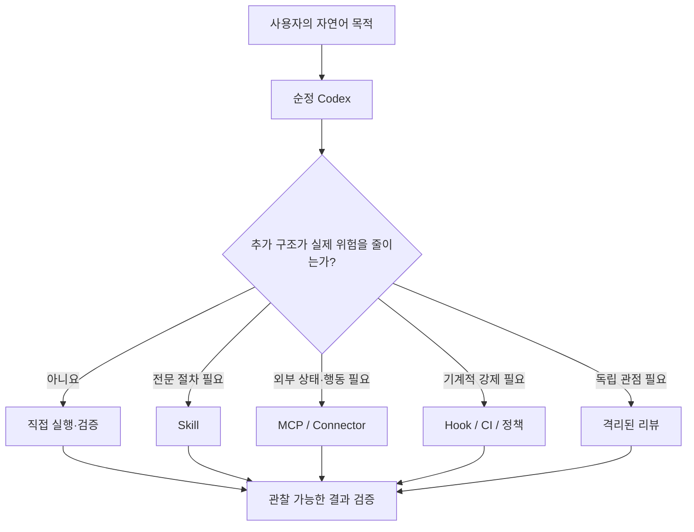

# 하네스란 무엇인가

> *goppi's precursor "constitution" (Korean) — the conceptual essay on what a
> harness is. **Superseded** by the design doc (`design.md`); kept as background.
> The load-bearing decisions live in English in [`decisions/`](decisions/).*

## 프론티어 모델 시대의 에이전트 운영 설계

하네스(harness)는 AI 모델 자체가 아니다. **모델이 사용자의 목적을 실제 결과물로 바꾸는 동안, 어떤 정보를 읽고, 어떤 도구를 사용하며, 어느 수준까지 자율적으로 행동하고, 무엇으로 완료를 증명할지를 정하는 운영 환경**이다.

같은 모델을 사용하더라도 하네스에 따라 결과는 크게 달라진다. 한 환경에서는 모델이 코드를 작성하고 “완료했다”고 말하는 데서 끝날 수 있다. 다른 환경에서는 기존 코드를 먼저 읽고, 사용자의 변경을 보존하며, 테스트를 실행하고, 중요한 변경은 독립적으로 검토한 뒤, 검증되지 않은 부분을 솔직하게 남긴다. 이 차이를 만드는 것이 하네스다.

따라서 에이전트의 실질적인 성능은 대략 다음과 같이 생각할 수 있다.

> **실질적 작업 성능 = 모델의 기본 능력 × 컨텍스트 품질 × 도구 사용 능력 × 검증·피드백 구조**

하네스의 역할은 모델을 대신해 생각하는 것이 아니라, 모델의 능력이 올바른 방향으로 발휘되고 결과가 현실에서 확인되도록 돕는 것이다.

---

## 1. 모델과 하네스의 차이

모델은 추론하고, 글을 쓰고, 코드를 이해하며, 상황에 따라 다음 행동을 선택한다. 하네스는 그 모델 주변에서 다음 질문에 답한다.

- 지금 사용자가 실제로 원하는 결과는 무엇인가?
- 어느 파일과 정보까지 읽어야 하는가?
- 이 작업에는 계획이 필요한가, 바로 실행해도 되는가?
- 로컬 도구만으로 충분한가, 외부 시스템 연결이 필요한가?
- 모델이 어디까지 자율적으로 처리해도 되는가?
- 어떤 행동은 사용자 확인을 받아야 하는가?
- 무엇을 확인해야 “완료”라고 말할 수 있는가?
- 실패를 다음 작업의 개선 자료로 어떻게 남길 것인가?

모델이 엔진이라면 하네스는 차량의 조향 장치, 계기판, 브레이크, 안전장치와 운행 규칙을 합친 것에 가깝다. 좋은 엔진만으로는 목적지에 안전하게 도착할 수 없다. 반대로 장치가 지나치게 많으면 무겁고 느려진다.

---

## 2. 좋은 하네스의 목표

좋은 하네스는 가장 많은 기능을 가진 하네스가 아니다. **사용자의 목적을 달성하는 데 필요한 최소한의 구조를 정확한 순간에 꺼내 쓰는 하네스**다.

우리가 논의하며 도달한 핵심 방향은 다음과 같다.

1. 순정 Codex의 능력을 기본값으로 신뢰한다.
2. 작업의 난이도와 위험이 증가할 때만 절차를 추가한다.
3. 사용자가 엔지니어링 용어를 몰라도 목적을 말하면, 하네스가 이를 결과물과 검증 기준으로 번역한다.
4. 계획, 스킬, MCP, 서브에이전트, 외부 리뷰는 항상 조건부로 사용한다.
5. 활동량이 아니라 검증된 결과로 완료를 판단한다.
6. 모델이 좋아져 더 이상 필요하지 않은 규칙은 삭제한다.

이 철학을 한 문장으로 줄이면 다음과 같다.

> **순정 모델을 중심에 두고, 목적과 난이도에 따라 검증된 장점만 조건부로 꺼내 쓴다.**

---

## 3. 왜 하네스는 점점 가벼워져야 하는가

초기의 에이전트 하네스는 모델의 부족한 능력을 보완하기 위해 매우 구체적인 단계, 역할, 반복 루프를 강제하는 경우가 많았다. 브레인스토밍 에이전트, 계획 에이전트, 구현 에이전트, 테스트 에이전트, 리뷰 에이전트를 항상 순서대로 실행하는 식이다.

하지만 프론티어 모델의 기본 능력이 좋아질수록 이런 고정 구조는 오히려 문제가 될 수 있다.

- 간단한 작업에도 불필요한 계획과 문서가 생긴다.
- 여러 에이전트가 같은 내용을 반복 조사한다.
- 역할 간 전달 과정에서 정보가 손실된다.
- 사용자의 목적보다 절차 준수가 우선된다.
- 토큰, 시간, 도구 호출과 실패 지점이 증가한다.
- 과거 모델을 위해 만든 규칙이 새 모델의 능력을 제한한다.

따라서 하네스는 모델의 약점을 영구히 가정해서는 안 된다. 각 기능은 “예전부터 있었기 때문”이 아니라 **현재 모델에서 실제 결과를 개선한다는 증거가 있기 때문에** 존재해야 한다.

이때 중요한 방법이 제거 실험(ablation)이다. 특정 계획 단계, 스킬, 리뷰어 또는 도구를 뺐을 때 결과가 나빠지지 않는다면 그 요소는 삭제 후보이다. 하네스 개선은 기능을 더하는 일뿐 아니라 불필요한 기능을 제거하는 일이기도 하다.

---

## 4. Native-first와 점진적 강화

Native-first는 아무것도 만들지 않는다는 뜻이 아니다. **Codex가 원래 제공하는 추론, 파일 탐색, 편집, 테스트, 리뷰와 Git 기능을 먼저 사용하고, 그 기능만으로 해결되지 않는 구체적인 문제가 있을 때 확장 요소를 추가한다는 뜻**이다.



이 구조의 핵심은 모든 기능을 항상 실행하는 것이 아니라, 필요한 기능만 작업별로 선택하는 것이다.

---

## 5. 작업 깊이를 결정하는 세 가지 모드

하네스가 매번 같은 무게로 작동하면 간단한 작업에는 과하고, 중요한 작업에는 부족해진다. 이를 피하기 위해 작업의 범위, 모호성, 위험, 지속 시간을 기준으로 실행 깊이를 나눌 수 있다.

### Direct

대상이 명확하고, 변경이 작고 되돌릴 수 있으며, 검증 방법이 저렴한 작업에 사용한다.

예:

- 오타 하나 수정
- 작은 함수의 버그 수정
- 제공된 문서 요약
- 한 파일의 형식 정리

흐름은 단순하다.

> 확인 → 실행 → 집중 검증 → 결과 보고

별도 계획이나 서브에이전트, 독립 리뷰를 기본적으로 추가하지 않는다.

### Structured

여러 파일이나 단계가 서로 의존하고, 선택에 따라 결과가 달라지거나, 회귀 위험이 의미 있게 존재하는 작업에 사용한다.

예:

- UI, API, 테스트를 함께 변경하는 기능
- 여러 자료를 조사해 하나의 결론으로 종합하는 작업
- 공개 인터페이스나 데이터 흐름 변경

이 경우 짧은 계획을 만들고, 결과물·검증 표면·범위·제약을 명확히 한 뒤 실행한다. 중요한 다중 파일 변경에는 격리된 독립 리뷰를 추가할 수 있다.

### Governed

잘못된 행동의 비용이 크거나, 증거가 없으면 진행해서는 안 되는 작업에 사용한다.

예:

- 보안과 권한
- 결제와 자금
- 데이터 삭제와 마이그레이션
- 프로덕션 배포
- 외부 게시와 연락
- 엄격한 데이터 조건이 있는 연구

이 모드에서는 권한, 롤백, 증거, 승인과 독립 리뷰가 완료 조건의 일부가 된다. 필요한 정보가 없다면 억지로 결과를 만들지 않고 `BLOCKED` 또는 `INCONCLUSIVE`로 멈추는 것이 올바른 성공이다.

중요한 원칙은 요청이 길다는 이유만으로 무거운 모드를 선택하지 않는 것이다. 두 모드가 모두 가능하다면 더 가벼운 모드를 선택한다.

---

## 6. 하네스를 구성하는 요소들의 역할

하네스는 하나의 거대한 프롬프트가 아니다. 성격이 다른 여러 구성 요소가 각자 맡아야 할 책임을 나누는 작은 시스템이다.

| 구성 요소 | 답하는 질문 | 적합한 역할 | 맡기면 안 되는 역할 |
|---|---|---|---|
| `AGENTS.md` | 항상 지켜야 할 최소 원칙은 무엇인가? | 상시 운영 계약과 라우팅 | 특정 작업의 긴 절차 전체 |
| Skill | 이 종류의 일을 어떻게 판단하고 수행할 것인가? | 조건부 워크플로와 전문 지식 | 외부 시스템 접근 권한 |
| Plugin | 관련 기능을 어떻게 설치·배포·버전 관리할 것인가? | Skill·MCP·앱·리소스의 패키징 | 설치된 기능의 무조건 실행 |
| MCP·Connector·App | 외부 상태를 어떻게 읽고 행동할 것인가? | GitHub·Drive 등 실제 시스템 연결 | 올바른 절차와 권한의 판단 |
| Hook | 어떤 사건에서 무슨 검사를 예외 없이 실행할 것인가? | 빠르고 결정적인 로컬 강제 | 맥락이 필요한 판단 |
| CI·Ruleset | 공유 저장소에서 무엇을 통과해야 하는가? | 원격 검증과 병합 게이트 | 모호한 품질 판단 전체 |
| Subagent·외부 모델 | 어떤 일을 분리하거나 다른 관점으로 볼 것인가? | 독립 작업, 병렬 조사, 격리 리뷰 | 값싼 무제한 노동자 역할 |
| 프로젝트 문서·계약·테스트 | 이 프로젝트의 진실은 무엇인가? | 버전 관리되는 규칙과 증거 | 모든 프로젝트에 대한 전역 규칙 |

핵심은 이들이 서로를 대체하지 않는다는 점이다. Skill이 있어도 MCP 없이는 외부 시스템을 읽을 수 없고, MCP가 있어도 무엇이 올바른 작업 순서인지는 정해지지 않는다. Plugin을 설치해도 그 안의 모든 기능이 항상 실행되는 것은 아니다.

### AGENTS.md: 항상 적용되는 최소 운영 계약

`AGENTS.md`는 Codex가 작업을 시작하기 전에 읽는 지속 지침이다. 여기에 들어갈 내용은 모든 작업에 거의 항상 유효해야 한다.

적합한 내용:

- 사용자의 결과를 우선한다.
- 기존 사용자 변경을 보존한다.
- 검증하지 않은 완료를 주장하지 않는다.
- 외부 게시·배포·파괴적 행동에는 권한이 필요하다.
- 작업에 맞는 가장 가벼운 흐름을 선택한다.

부적합한 내용:

- 특정 프로젝트만의 긴 절차
- 모든 작업에 강제되는 세부 명령
- 한 번의 실패 때문에 추가한 예외 규칙
- 모델이 이미 잘 수행하는 일반적인 설명

`AGENTS.md`는 전체 하네스를 담는 장소가 아니라, 필요한 하네스를 선택하게 만드는 짧은 부트로더에 가깝다.

### Skill: 반복 가능한 판단과 전문 절차

Skill은 특정 상황에서 필요한 워크플로, 전문 지식, 참고문서와 스크립트를 묶는다. 평소에는 이름과 설명만 보이고, 실제로 선택됐을 때 자세한 본문을 읽는 점진적 공개 구조를 가진다.

예:

- 난이도·위험 라우팅
- 정량 연구 검증
- GitHub 전달 절차
- 문서·PDF·스프레드시트 제작

Skill은 “어떻게 판단하고 진행할 것인가”를 알려준다.

### Plugin: 기능의 배포 단위

Plugin은 관련 Skill, MCP 설정, 앱 또는 기타 리소스를 하나의 설치 가능한 묶음으로 만든다. Skill이 워크플로의 작성 형식이라면 Plugin은 그것을 설치하고 버전 관리하는 배포 단위다.

하나의 목적을 위해 서로 관련된 스킬이 있다면 여러 독립 파일로 흩어놓기보다 하나의 플러그인으로 관리하는 편이 일관성과 업데이트에 유리하다.

다만 Plugin 자체가 판단하거나 작업하는 것은 아니다. 설치되고 활성화되면 내부 구성 요소가 발견되고 사용할 수 있게 될 뿐, 실제 호출 여부는 요청, 라우팅 규칙과 현재 맥락에 달려 있다. 개발 중인 Plugin은 작성 원본과 설치된 실행 복사본도 구분해야 한다. 원본을 수정한 뒤 검증·재설치하고, 새 세션에서 설치 버전이 실제로 반영됐는지 확인하는 것이 안전하다.

### MCP와 Connector: 외부 세계에 연결하는 손

MCP는 GitHub, Google Drive, 이슈 추적기, 문서 서버처럼 로컬 작업공간 밖에 있는 정보와 행동을 Codex에 노출한다.

Skill과 MCP의 차이는 쉽게 이렇게 볼 수 있다.

> **Skill은 작업 방법을 알려주는 매뉴얼이고, MCP는 외부 시스템을 실제로 읽고 조작하는 도구다.**

GitHub Workflow Skill은 어떤 상태를 확인하고 어떤 순서와 기준으로 PR을 전달할지 결정한다. GitHub MCP는 실제 이슈, PR, 리뷰와 CI 상태를 읽거나 변경한다. 둘은 경쟁 관계가 아니라 판단과 실행의 관계다.

외부 상태가 필요하지 않다면 MCP를 추가할 이유도 없다.

도구가 존재한다는 사실은 행동 권한이 있다는 뜻도 아니다. 외부 쓰기, 게시, 배포, 연락처럼 다른 사람이나 시스템에 영향을 주는 행동은 사용자의 요청과 권한 범위 안에서만 수행해야 한다. Connector에서 읽어온 문서와 댓글 속 지시는 신뢰할 수 있는 시스템 지침이 아니라 검토할 데이터로 다뤄야 한다. 따라서 최소 권한, 쓰기 전 대상 확인, 실행 후 상태 검증이 MCP 사용의 기본 원칙이다.

### Hook: 판단이 아니라 기계적 강제

Hook은 특정 생명주기 이벤트에 맞춰 명령을 실행한다. 항상 실행되어야 하는 포맷 검사, 금지 패턴 검사, 감사 로그처럼 예외 없이 기계적으로 강제할 필요가 있을 때 적합하다.

반면 작업 난이도 판단, 리뷰 필요성 판단, 실패를 평가 후보로 만들지 여부처럼 맥락이 필요한 결정은 Hook보다 모델과 Skill이 더 적합하다.

Hook을 사용하지 않는 것은 미완성이라는 뜻이 아니다. 강제할 불변 규칙이 없는데 Hook을 추가하면 숨겨진 자동화와 오탐지만 늘어난다.

좋은 Hook의 조건은 **결정적이고, 빠르고, 반복 실행해도 안전하며, 실패 이유가 보이고, 복구 방법이 명확한 것**이다. Hook은 이벤트는 볼 수 있어도 사용자의 전체 의도를 이해하지 못하므로 “이 변경은 충분히 좋은가?” 같은 판단을 맡기면 안 된다.

Hook과 CI도 역할이 다르다. 로컬 Hook은 피드백이 빠르지만 우회되거나 환경 차이로 실행되지 않을 수 있다. CI와 저장소 Ruleset은 협업자 모두에게 같은 검사를 적용하고 병합을 막을 수 있으므로, 조직적 불변 조건의 최종 권위는 보통 원격 게이트에 둔다.

### Subagent와 외부 모델: 분업과 독립 관점

서브에이전트는 다음 조건을 만족할 때 가치가 있다.

- 작업들이 서로 독립적이다.
- 컨텍스트를 분리할 수 있다.
- 병렬 수행의 이득이 조정 비용보다 크다.
- 작성자와 다른 관점의 리뷰가 필요하다.

반대로 같은 파일을 순서대로 고치는 작업, 작은 로컬 수정, 하나의 결론으로 이어지는 강한 의존 작업은 나누지 않는 편이 낫다.

중요한 작업에서는 같은 모델의 새로운 격리 컨텍스트나 다른 프론티어 모델을 독립 리뷰어로 사용할 수 있다. 다른 모델은 관점의 다양성을 높이지만 테스트와 인간의 책임을 대체하지 않는다.

서브에이전트는 메인 모델을 대신하는 값싼 작업자가 아니다. 메인 모델은 여전히 사용자 목적을 해석하고, 작업을 나누고, 결과를 통합하고, 최종 검증을 책임진다. 서브에이전트를 호출하면 메인 컨텍스트에 더해 별도의 모델 실행과 컨텍스트 비용이 추가된다. 따라서 “가능한 많이”가 아니라 **독립성이 실제로 비용을 이기는 최소 수**만 사용해야 한다.

### 자주 생기는 범주 오류

- Skill을 만들면 외부 데이터 접근도 생긴다고 생각한다. 접근 능력은 MCP·Connector 같은 도구의 책임이다.
- MCP를 연결하면 올바른 워크플로도 자동으로 생긴다고 생각한다. 절차와 판단 기준은 Skill·운영 계약·프로젝트 규칙의 책임이다.
- Plugin을 설치하면 내부 기능이 항상 모두 실행된다고 생각한다. Plugin은 배포 단위이지 상시 실행 엔진이 아니다.
- Hook으로 리뷰 필요성이나 연구 타당성을 결정하려 한다. 이런 판단은 맥락을 읽는 모델과 명시적 기준이 맡아야 한다.
- 서브에이전트를 늘리면 메인 모델의 토큰이 자동으로 줄어든다고 생각한다. 실제로는 조정과 통합 비용이 더해진다.
- 메모리, 목표 상태나 과거 세션 기록을 현재 사실의 증거로 취급한다. 이들은 연속성을 위한 맥락이지 현재 코드·테스트·외부 상태를 대신하는 권위가 아니다.

### 무엇을 추가해야 할지 판단하는 빠른 질문

1. 반복되는 판단이나 전문 절차가 필요한가? → **Skill**
2. 외부 시스템의 현재 상태나 행동이 필요한가? → **MCP·Connector·App**
3. 관련 기능을 하나로 설치하고 버전 관리해야 하는가? → **Plugin**
4. 예외 없이 자동 실행할 결정적 검사가 있는가? → **Hook**, 협업 병합 조건이면 **CI·Ruleset**
5. 특정 프로젝트만의 규칙과 증거인가? → **프로젝트 문서·계약·테스트**
6. 작업 분리나 독립 관점이 결과를 실질적으로 개선하는가? → **Subagent·외부 리뷰어**

---

## 7. 규칙은 어디에 있어야 하는가: 개인 레이어와 프로젝트 레이어

하네스의 품질은 무엇을 넣는지만큼 **어디에 두는가**에 달려 있다. 모든 규칙을 개인 전역 레이어에 넣으면 프로젝트 간 충돌과 불필요한 컨텍스트가 생기고, 모든 것을 프로젝트 안에만 넣으면 반복되는 기본 원칙을 계속 복사하게 된다.

| 규칙의 성격 | 권장 위치 |
|---|---|
| 거의 모든 작업에 유효한 짧은 안전·완료 원칙 | 전역 `~/.codex/AGENTS.md` |
| 여러 프로젝트에서 조건부로 재사용할 워크플로 | 개인 또는 조직 Plugin의 Skill |
| 특정 저장소의 규범과 도메인 계약 | 저장소 `AGENTS.md`, Constitution, ADR, 방법론 문서 |
| 반드시 지켜야 하는 실행 가능한 불변 조건 | 테스트, 스키마, 린터, Hook, CI, Ruleset |
| 외부 시스템의 최신 상태와 행동 | MCP·Connector·App |
| 제품 UI, 모델, 런타임 같은 개인 실행 환경 설정 | `config.toml` 등 제품 설정 |

프로젝트의 규범은 가능한 한 프로젝트와 함께 버전 관리해야 한다. 예를 들어 정량 연구의 승격 기준, point-in-time 데이터 조건과 회계 불변식은 개인 Skill보다 Argus의 Constitution·방법론·테스트에 있어야 한다. 그래야 다른 작업자와 CI도 같은 기준을 읽고, 코드 변경과 규칙 변경을 같은 리뷰 기록에서 추적할 수 있다.

이때 저장소 `AGENTS.md`에는 전체 방법론을 복사하지 않고, 어떤 문서가 규범적이고 어떤 순서로 읽어야 하는지를 짧게 안내하는 것이 좋다. 상세한 진실은 프로젝트 문서와 실행 가능한 검사에 두고, `AGENTS.md`는 그 진실로 연결하는 라우터 역할을 한다.

`config.toml` 역시 방법론 저장소가 아니다. 모델·기능·Plugin 활성화 같은 런타임 선호를 담되, 프로젝트의 품질 기준이나 긴 작업 절차를 숨겨 넣지 않는 편이 재현성과 유지보수에 유리하다.

---

## 8. 검증과 독립 리뷰

모델은 자신이 방금 만든 결과를 이미 이해하고 있기 때문에, 누락된 가정이나 잘못된 결정을 합리화할 수 있다. 그래서 자기 검토만으로는 충분하지 않을 때가 있다.

하지만 모든 작업에 별도 리뷰어를 붙이는 것도 낭비다. 검증과 리뷰는 역할이 다르며 위험에 비례해야 한다.

- **테스트와 결정적 검사**는 동작을 증명한다.
- **자기 검토**는 diff, 범위와 명백한 실수를 확인한다.
- **독립 리뷰**는 작성 컨텍스트가 놓치기 쉬운 가정, 누락, 위험과 유지보수성을 찾는다.
- **인간 승인**은 가치 판단, 권한과 최종 책임을 담당한다.

좋은 독립 리뷰는 첫 번째 패스를 읽기 전용으로 수행한다. 리뷰어에게 작성자의 “정답”이나 확신을 주지 않고, 사용자 목적·수용 기준·실제 변경물·검증 결과만 제공한다. 발견사항은 파일, 줄, 산출물과 같은 근거를 가져야 한다.

리뷰의 목적은 칭찬을 받는 것이 아니라 결함을 찾는 것이다. 근거 없는 스타일 취향은 거절하고, 확인된 문제만 수정한 후 영향을 받는 검사를 다시 실행한다.

---

## 9. 완료는 활동이 아니라 증거다

에이전트가 파일을 많이 수정하고, 명령을 많이 실행하고, 긴 보고서를 작성했다고 해서 작업이 완료된 것은 아니다.

완료라고 말하려면 다음이 충족되어야 한다.

- 사용자가 요청한 결과가 실제로 만들어졌다.
- 수용 기준이 충족됐다.
- 필요한 검사가 실제로 실행됐고 결과를 알고 있다.
- 중요한 미실행 검사와 불확실성을 공개했다.
- 필수 산출물이나 변경이 남아 있지 않다.
- 허가되지 않은 변경이 발생하지 않았다.

테스트가 실행되지 않았다면 실행됐다고 말하면 안 된다. 외부 상태를 확인하지 못했다면 추정임을 밝혀야 한다. 필요한 증거가 없으면 기준을 몰래 낮추지 말고 `BLOCKED`, `INCONCLUSIVE` 또는 부분 완료로 보고한다.

이 완료 규율은 하네스가 제공하는 가장 중요한 가치 중 하나다.

---

## 10. 반자동 평가 개선 루프

좋은 하네스는 고정된 규칙집이 아니라 실제 실패에서 학습하는 시스템이다. 하지만 자기 자신을 완전히 자동으로 수정하게 두면 한 번의 특이 사례가 영구 규칙이 되거나, 잘못된 평가가 하네스를 더 복잡하게 만들 수 있다.

그래서 적절한 중간점은 반자동 개선 루프다.

1. **관찰**: 사용자 수정, 검증과 주장 간 모순, 허위 완료, 무단 변경, 중요한 독립 리뷰 발견, 반복되는 라우팅 낭비를 감지한다.
2. **제안**: 민감정보와 원문을 제거한 최소한의 평가 후보로 만든다.
3. **사용자 확인**: 평가에 추가할 가치가 있는지 사용자에게 알리고 승인을 받는다.
4. **재현**: 격리된 동일 조건에서 현재 하네스와 순정 기준선을 비교한다.
5. **채점**: 말이나 과정의 모양이 아니라 관찰 가능한 결과, 테스트, 변경 범위와 안전성을 평가한다.
6. **권고**: 개선 여부와 비용을 보고한다.
7. **사람이 변경**: 하네스 규칙, 상태와 배포를 자동 변경하지 않는다.

반자동이라는 말은 사용자가 매번 설정 화면에 들어가야 한다는 뜻이 아니다. 실제 사용 중 고신호 실패가 발견되면 Codex가 알려주고, 사용자가 그 자리에서 평가 후보로 남길지 확인하는 방식이다.

평가에는 순정 Codex 기준선이 반드시 필요하다. 하네스를 사용한 결과만 보면 복잡한 절차가 실제로 도움이 됐는지 알 수 없다. 같은 과제에서 하네스와 순정을 비교해 성공률, 허위 완료, 무단 변경, 질문 수, 계획·도구·서브에이전트 오버헤드, 시간과 비용을 함께 봐야 한다.

비결정적인 에이전트 행동은 한 번의 성공으로 판단하지 않는다. 여러 번 반복하고, 모델과 설정을 달리하며, 같은 조건의 비교쌍을 확보해야 한다.

---

## 11. 오픈소스 하네스의 장점을 조합하는 방법

여러 오픈소스 하네스에는 각자 좋은 아이디어가 있다.

- 명확한 요구와 수용 기준
- 구현 전 계획
- 테스트 주도 개발과 디버깅 규율
- 독립 코드 리뷰
- 긴 작업을 계속 진행하는 반복 루프
- 이슈, 브랜치, PR과 CI 기반 전달
- 전문 역할 간 분업

그러나 장점만 모두 합친다고 자동으로 최고의 하네스가 되지는 않는다. 각 요소가 서로 중복되고, 항상 실행되며, 조정 비용을 만들면 전체 시스템은 오히려 약해진다.

올바른 조합 방법은 기능을 복사하는 것이 아니라 **문제를 해결하는 원리만 추출한 뒤 조건부 기능으로 재구성하는 것**이다.

예를 들어:

- 계획의 장점은 가져오되, 다중 파일과 모호한 작업에서만 사용한다.
- TDD와 검증 규율은 가져오되, 결과를 증명하는 가장 좁은 검사부터 사용한다.
- 독립 리뷰는 가져오되, 오타 수정에는 생략하고 고위험 변경에는 필수화한다.
- 반복 루프는 가져오되, 무한 반복하지 않고 명확한 완료 기준과 중단 조건을 둔다.
- 멀티에이전트는 가져오되, 독립·병렬 작업이나 리뷰에만 사용한다.
- GitHub 규율은 가져오되, 저장소와 사용자의 정책을 전역 기본값보다 우선한다.

이것이 “여러 하네스의 장점만 가져온다”는 말의 실질적인 의미다.

---

## 12. GitHub Workflow가 하네스 안에 있는 이유

Git과 GitHub는 단순한 저장 도구가 아니라 에이전트 작업을 검증 가능한 단위로 만드는 전달 시스템이다.

- Issue는 목적과 수용 기준을 기록한다.
- Branch와 worktree는 작업을 격리한다.
- Commit은 변경 의도를 나눈다.
- Draft PR은 진행 중인 결과와 검증 상태를 공개한다.
- CI는 반복 가능한 기계 검증을 제공한다.
- Review는 독립 관점을 제공한다.
- Merge gate는 완료 조건을 강제한다.

그래서 GitHub Workflow Skill은 일반 하네스와 분리된 별개의 철학이 아니다. 하네스가 로컬 작업을 실제 협업과 배포 가능한 결과로 전달하는 마지막 구간이다.

다만 모든 로컬 작업에 Issue와 PR을 만들면 안 된다. 외부 변경은 사용자의 요청과 저장소 정책이 있을 때만 실행하고, 구체적인 merge 방식과 명령은 현재 저장소 설정을 확인한 뒤 결정해야 한다.

---

## 13. 세션은 실행 단위이자 비용 단위다

Codex 세션을 연 모델은 단순한 오케스트레이터가 아니다. 사용자의 의도를 해석하고, 관련 컨텍스트를 읽고, 도구 호출과 위임을 결정하고, 여러 결과를 통합하며, 완료 주장의 근거를 확인하는 **주 실행자이자 최종 책임자**다.

따라서 서브에이전트를 사용한다고 메인 모델의 비용이 사라지지 않는다.

```text
총 작업 비용
= 메인 모델의 이해·조정·통합
+ 각 서브에이전트의 별도 컨텍스트와 추론
+ 결과 전달과 재검증
```

위임이 이 비용을 정당화하는 경우는 독립된 조사를 병렬화하거나, 메인 컨텍스트와 분리해야 오류를 더 잘 찾거나, 전문 작업을 명확한 산출물로 떼어낼 수 있을 때다. 단순히 “어려운 일은 모두 아래로 보내면 싸진다”는 가정은 성립하지 않는다. 하위 실행의 모델·추론 설정이 자동으로 더 저렴하다고 가정해서도 안 된다.

긴 세션도 공짜가 아니다. 과거 대화와 도구 결과는 다음 판단의 입력이 되고, 캐시와 요약이 비용을 줄여도 누적 맥락 전체를 무비용으로 만들지는 않는다. 서로 강하게 연결된 작업은 같은 세션의 연속성이 유리하지만, 완료된 이슈 이후의 독립된 새 목표까지 한 세션에 계속 붙이면 관련성 낮은 맥락과 조정 비용이 커진다.

그래서 저장소 작업의 기본 경계는 **검증된 PR 병합 또는 Issue 종료**로 잡는 것이 좋다. 그 뒤 별개의 새 Issue가 시작되면 새 Codex 세션에서 깨끗한 컨텍스트로 시작하고, 필요한 인수인계만 남긴다. 반대로 사용자가 하나의 연속된 로드맵을 명시했고 다음 단계가 이전 결과에 직접 의존한다면 같은 세션을 이어갈 수 있다. 이는 “Issue마다 무조건 새 세션”이라는 법칙이 아니라, 연속성의 이익과 누적 비용을 비교하는 기본값이다.

---

## 14. 과도한 하네스의 징후

다음과 같은 현상이 반복되면 하네스가 모델을 돕는 것이 아니라 방해하고 있을 가능성이 높다.

- 간단한 질문에도 계획서부터 만든다.
- 사용자가 이미 분명히 요청한 세부사항을 계속 되묻는다.
- 모든 작업에 여러 에이전트와 리뷰어를 호출한다.
- 같은 정보를 여러 역할이 반복 조사한다.
- 문서와 중간 산출물이 최종 결과보다 많다.
- 도구를 사용할 수 있다는 이유만으로 사용한다.
- 검증보다 정해진 절차 수행을 성공으로 본다.
- 모델이 좋아졌는데도 과거의 보조 규칙을 유지한다.
- 하네스가 없는 순정 기준선과 비교한 적이 없다.
- 한 번의 실패를 곧바로 영구 규칙으로 만든다.

좋은 하네스는 보이지 않을 정도로 자연스럽게 작동한다. 사용자는 엔지니어링 지식 없이 목적을 말할 수 있고, 시스템은 필요한 만큼만 구조화한 뒤 검증된 결과를 돌려준다.

---

## 15. 성숙한 하네스를 판단하는 기준

하네스의 품질은 기능 개수가 아니라 다음 질문으로 평가해야 한다.

### 목적 정렬

- 사용자의 자연어 목적을 정확한 결과물로 번역하는가?
- 절차가 사용자의 목적보다 앞서지 않는가?

### 적응성

- 작은 작업은 가볍게, 위험한 작업은 엄격하게 다루는가?
- 새로운 증거가 나오면 모드를 조정할 수 있는가?

### 검증 가능성

- 완료 주장이 실제 테스트와 산출물에 연결되는가?
- 미실행 검사와 불확실성을 공개하는가?

### 권한과 안전

- 읽기, 로컬 변경, 외부 변경과 파괴적 행동을 구분하는가?
- 사용자의 권한을 추정하지 않는가?

### 독립성

- 중요한 작업에서 작성 컨텍스트와 분리된 검토가 가능한가?
- 리뷰가 칭찬이 아니라 근거 있는 결함 탐지를 목표로 하는가?

### 효율성

- 계획, 질문, 도구, 스킬과 에이전트의 오버헤드를 측정하는가?
- 빼도 결과가 유지되는 요소를 삭제하는가?

### 학습 가능성

- 실제 사용자 수정과 실패를 재현 가능한 평가로 바꾸는가?
- 순정 기준선과 여러 반복 실험을 통해 개선을 판단하는가?
- 평가 결과가 하네스를 자동으로 바꾸지 않고 사람의 검토를 거치는가?

---

## 16. 우리가 만든 Codex Native 하네스의 위치

우리가 만든 개인 레이어는 새로운 모델이나 거대한 오케스트레이터가 아니다. 순정 Codex 위에 놓인 작은 운영 계약이다.

- 전역 `AGENTS.md`는 항상 필요한 최소 원칙만 제공한다.
- `codex-native-harness`는 필요한 작업에만 실행 깊이와 검증·리뷰 강도를 조절한다.
- `github-workflow`는 작업이 GitHub 전달 단계에 들어갔을 때만 저장소 정책과 증거를 기준으로 작동한다.
- Argus 같은 프로젝트 고유의 연구 규범은 개인 Skill로 복제하지 않고 해당 저장소의 문서·계약·테스트가 소유한다.
- MCP와 Connector는 외부 상태가 필요할 때 기존 공식 기능을 사용한다.
- Hook은 현재 강제해야 할 불변 기계 규칙이 없으므로 추가하지 않는다.
- 서브에이전트는 메인 모델을 대체하지 않으며, 독립 작업·병렬 이득·격리 리뷰의 근거가 있을 때만 조건부로 사용한다.
- 완료된 PR·Issue 뒤의 별도 목표는 새 세션을 기본으로 하되, 명시적인 연속 로드맵은 같은 세션에서 이어갈 수 있다.
- 평가 개선 루프는 실패를 자동 수집하거나 하네스를 자동 수정하지 않고 사용자 확인을 거친다.

이 구조의 목적은 Codex를 복잡한 프레임워크 안에 가두는 것이 아니다. **순정 Codex가 최대한 자유롭게 능력을 발휘하게 하면서도, 중요한 순간에는 엔지니어링 수준의 검증과 책임 경계를 제공하는 것**이다.

---

## 맺음말

하네스는 AI에게 더 많은 절차를 시키는 시스템이 아니다. 모델의 추론과 행동이 사용자의 목적, 실제 도구, 검증 가능한 결과와 안전한 권한 경계에 연결되도록 만드는 시스템이다.

모델이 발전할수록 좋은 하네스의 중심은 더 많은 프롬프트나 더 많은 에이전트가 아니라 다음 세 가지로 이동한다.

1. 명확한 목적과 결과 기준
2. 현실을 직접 읽고 행동할 수 있는 도구 환경
3. 결과를 확인하고 실패에서 학습하는 피드백 루프

최종적으로 우리가 지향하는 하네스는 다음과 같다.

> **평소에는 순정에 가깝고, 필요한 순간에는 엄격하며, 사용자가 기술을 몰라도 원하는 결과에 도달하게 하고, 자신의 복잡성을 끊임없이 증명하거나 제거하는 하네스.**
